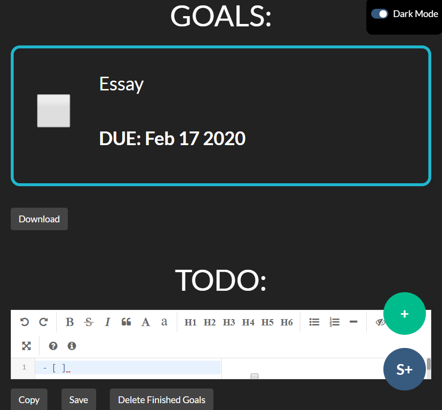

# Goals Project

## About

This project is a web app that tracks your goals and has a TODO editor in markdown

You can run on a local server or just put in shell:startup for Windows.

## How to use

Click the (+) button on the bottom right corner to add a goal.

Check the goal if you have finished the goal and it will go to the finished goal section (you need to press the finished goal header to reveal all of the finished goals)

After writing on the markdown editor, you must save it because the autosave is every 100 minutes. 

If you wish to copy from the markdown editor, click the copy button below the editor. 

To save any of the goals or markdown text, click on download for goals and the (S+) at the bottom right corner for markdown editor

Automatically set to dark mode, if you want light mode (not recommended), click on the dark mode switch.

## Libs

* jQuery
* jQuery datetimepicker
* [Editor.md](https://github.com/pandao/editor.md)

## Licence

The rules for copy and distributing this project licence are
outlined in the licence.txt file.

This project is under an MIT licence

